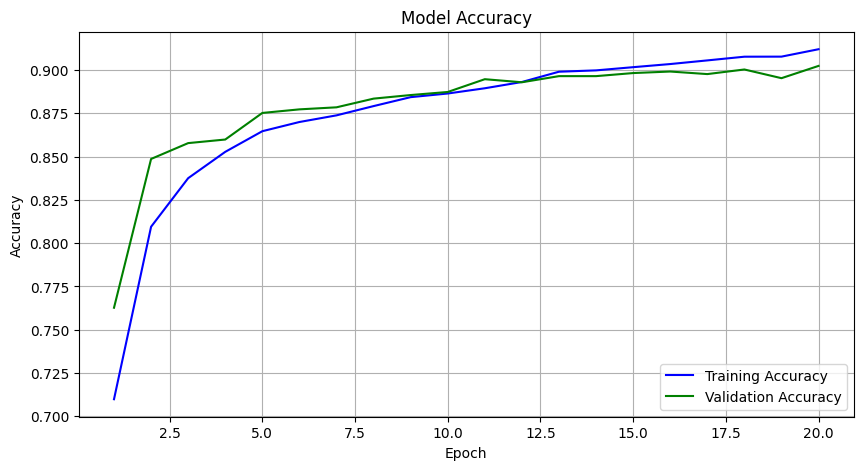
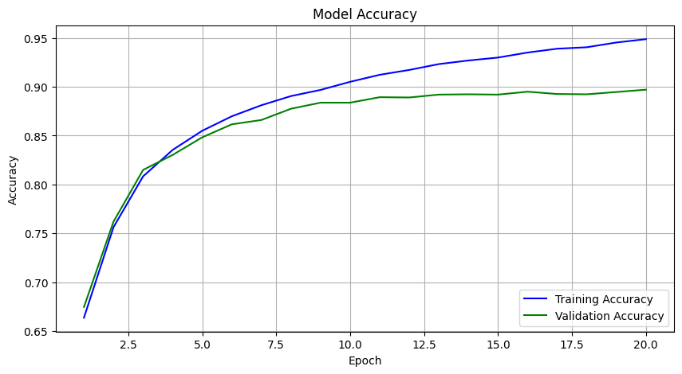

# UAP-ML: Sentiment Analysis of Amazon Mobile Phone Reviews

## Deskripsi Proyek  
Proyek ini bertujuan untuk membangun sistem klasifikasi sentimen ulasan produk Amazon, khususnya untuk kategori _unlocked mobile phones_. Sistem ini menggunakan metode deep learning berbasis CNN dan LSTM untuk memproses data teks ulasan dan memprediksi sentimen (positif, negatif, atau netral).

Tujuan utama proyek ini adalah:  
- Menganalisis performa dua arsitektur model (CNN dan LSTM).  
- Memberikan hasil analisis yang membantu dalam memahami ulasan pelanggan.  
- Menyediakan aplikasi web sederhana untuk memprediksi sentimen ulasan secara real-time.

**Dataset**: Ulasan produk berasal dari [Amazon Mobile Reviews Dataset](https://www.kaggle.com/datasets/PromptCloudHQ/amazon-reviews-unlocked-mobile-phones/data).  

---

## Langkah Instalasi  

1. **Clone repository ini**  
   ```bash
   git clone https://github.com/Nollingd/UAP-ML.git
   cd UAP-ML
   ```

2. **Install dependencies**  
   Pastikan Anda memiliki Python terinstal di sistem Anda. Jalankan perintah berikut untuk menginstal semua paket yang diperlukan:  
   ```bash
   pip install -r requirements.txt
   ```

3. **Jalankan aplikasi web**  
   Aplikasi web menggunakan Gradio. Untuk menjalankannya, buka file Jupyter Notebook yang ada di repository ini, dan jalankan kode Gradio. Setelah itu, URL aplikasi akan muncul di terminal/Jupyter Notebook. Klik URL tersebut untuk mengakses aplikasi web.  

---

## Deskripsi Model  

### CNN (Convolutional Neural Network)  
CNN digunakan untuk memproses data teks ulasan dengan memanfaatkan fitur spasial dari kata-kata. Arsitektur CNN yang digunakan:  
- Input layer (word embeddings)  
- Convolutional layer  
- Max pooling layer  
- Fully connected layer  
- Output layer  

**Gambar Struktur CNN:**  


### LSTM (Long Short-Term Memory)  
LSTM digunakan untuk menangkap konteks jangka panjang dalam data teks. Arsitektur LSTM yang digunakan:  
- Input layer (word embeddings)  
- LSTM layer  
- Dropout layer  
- Fully connected layer  
- Output layer  

**Gambar Struktur LSTM:**  


### Analisis Performa  
Model dievaluasi menggunakan metrik seperti akurasi, precision, recall, dan F1-score pada data validasi. Hasil menunjukkan bahwa:  
- **CNN** lebih unggul dalam memproses data teks pendek dengan pola yang jelas.  
- **LSTM** memberikan hasil lebih baik untuk teks yang memiliki konteks panjang.  

---

## Hasil dan Analisis  

### Perbandingan Model  
Berikut adalah tabel perbandingan performa CNN dan LSTM:  

| **Model**  | **Akurasi** | **Precision** | **Recall** | **F1-Score** |  
|------------|-------------|---------------|------------|--------------|  
| CNN        | 89.8%       | 88.5%         | 87.0%      | 88.0%        |  
| LSTM       | 89.7%       | 87.5%         | 88.5%      | 88.0%        |  


### Learning Curve Model LSTM

Model LSTM yang telah dilatih berhasil mencapai akurasi yang baik pada dataset uji. Berikut adalah grafik yang menunjukkan performa model selama pelatihan dan validasi:



Gambar di atas menunjukkan perbandingan antara akurasi dan loss pelatihan dan validasi selama 20 epoch.

### Learning Curve Model CNN

Model CNN yang telah dilatih berhasil mencapai akurasi yang baik pada dataset uji. Berikut adalah grafik yang menunjukkan performa model selama pelatihan dan validasi:



Gambar di atas menunjukkan perbandingan antara akurasi dan loss pelatihan dan validasi selama 20 epoch.

---

## Link Live Demo  
Aplikasi web dapat diakses dengan menjalankan kode Gradio di Jupyter Notebook. Setelah dijalankan, URL akan muncul di terminal atau output Notebook. Klik URL tersebut untuk mengakses aplikasi dan inputkan teks ulasan yang akan diprediksi.  

**Repository:** [UAP-ML GitHub](https://github.com/Nollingd/UAP-ML.git)  

---

## Author  
Proyek ini dikembangkan oleh:  
- **Naufal Angling**  
- **Kontak:** [nopalangling@gmail.com](mailto:nopalangling@gmail.com)  
