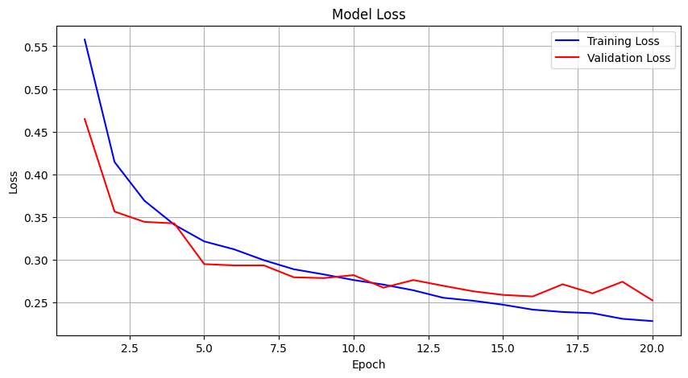
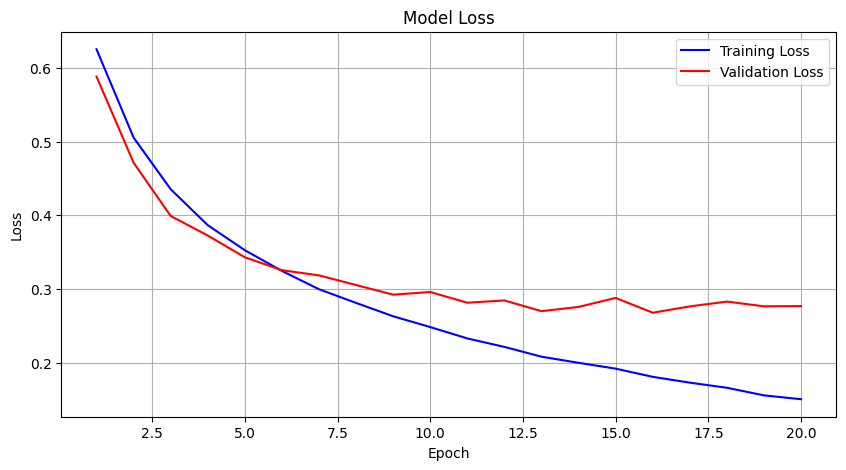

# UAP-ML: Klasifikasi Sentimen Ulasan Pelanggan pada Produk Ponsel Bekas Berbasis Neural Network

## Deskripsi Proyek  
Proyek ini bertujuan untuk membangun sistem klasifikasi sentimen ulasan produk Amazon, khususnya untuk kategori _unlocked mobile phones_. Sistem ini menggunakan metode deep learning berbasis CNN dan LSTM untuk memproses data teks ulasan dan memprediksi sentimen (positif atau negatif).

Tujuan utama proyek ini adalah:  
- Menganalisis performa dua arsitektur model (CNN dan LSTM).  
- Memberikan hasil analisis yang membantu dalam memahami ulasan pelanggan.  
- Menyediakan aplikasi web sederhana untuk memprediksi sentimen ulasan secara real-time.

**Dataset**: Ulasan produk berasal dari [Amazon Mobile Reviews Dataset](https://www.kaggle.com/datasets/PromptCloudHQ/amazon-reviews-unlocked-mobile-phones/data).  

## Preprocessing Data
Sebelum melatih model, data ulasan pelanggan yang berupa teks perlu dipersiapkan melalui beberapa tahapan preprocessing untuk memastikan kualitas dan konsistensi input. Tahapan preprocessing yang dilakukan adalah sebagai berikut:

1. **Data Cleaning**
   - Penghapusan URL: URL dalam teks dihapus karena tidak memberikan informasi relevan untuk analisis sentimen.
   - Penghapusan Karakter Non-Alfabet: Karakter non-alfabet seperti angka, tanda baca, dan simbol lainnya dihapus agar hanya kata-kata yang relevan yang tersisa.
   - Menghapus Spasi Berlebih: Semua spasi ekstra dihapus untuk menjaga teks tetap bersih dan terstruktur.

2. **Lowercasing**
   Semua teks diubah menjadi huruf kecil agar kata yang sama dengan kapitalisasi berbeda (misalnya, "Phone" dan "phone") dianggap identik. Hal ini mengurangi variasi yang tidak perlu dalam data.
3. **Lemmatization**
   Lemmatization mengubah kata menjadi bentuk dasarnya (lemma). Misalnya, "running" menjadi "run", atau "better" menjadi "good". Lemmatization memperhitungkan konteks dalam kalimat sehingga menghasilkan kata dasar yang tepat.
Proses ini dilakukan menggunakan pustaka nltk, yang memberikan alat untuk memproses teks secara efisien.

---

## Langkah Instalasi IDE Local 

1. **Clone repository ini**  
   ```bash
   git clone https://github.com/Nollingd/UAP-ML.git
   cd UAP-ML
   ```

2. **Install dependencies**  
   Pastikan Anda memiliki Python terinstal di sistem Anda. Jalankan perintah berikut untuk menginstal semua paket yang diperlukan:  
   ```bash
   pip install -r requirements.txt
   ```
3. **Ekstrak Dataset**  
    Lakukan ekstraksi atau unzip untuk file dataset yang sudah bersih dan tinggal implementasi model.
   
3. **Jalankan aplikasi web**  
   Aplikasi web menggunakan Gradio. Untuk menjalankannya, buka file Jupyter Notebook yang ada di repository ini, dan jalankan kode Gradio. Setelah itu, URL aplikasi akan muncul di terminal/Jupyter Notebook. Klik URL tersebut untuk mengakses aplikasi web.  

4. **Catatan**  
   Wajib run urut dari atas agar memunculkan file tokenizer dan model.  
---

## Deskripsi Model  

### CNN (Convolutional Neural Network)  
CNN digunakan untuk memproses data teks ulasan dengan memanfaatkan fitur spasial dari kata-kata. Arsitektur CNN yang digunakan:  
- Input layer (word embeddings)  
- Convolutional layer  
- Max pooling layer  
- Fully connected layer  
- Output layer  

**Gambar Struktur CNN:**  


### LSTM (Long Short-Term Memory)  
LSTM digunakan untuk menangkap konteks jangka panjang dalam data teks. Arsitektur LSTM yang digunakan:  
- Input layer (word embeddings)  
- LSTM layer  
- Dropout layer  
- Fully connected layer  
- Output layer  

**Gambar Struktur LSTM:**  
 

---

## Hasil dan Analisis  

### Perbandingan Model  
Berikut adalah tabel perbandingan performa CNN dan LSTM:  

| **Model**  | **Akurasi** | **Precision** | **Recall** | **F1-Score** |  
|------------|-------------|---------------|------------|--------------|  
| CNN        | 89.8%       | 88.5%         | 87.0%      | 88.0%        |  
| LSTM       | 89.7%       | 87.5%         | 88.5%      | 88.0%        |  


### Learning Curve Model LSTM

Model LSTM yang telah dilatih berhasil mencapai akurasi yang baik pada dataset uji. Berikut adalah grafik yang menunjukkan performa model selama pelatihan dan validasi:

<div style="display: flex; justify-content: space-around;">
  
  
</div>

Gambar di atas menunjukkan perbandingan antara akurasi dan loss pelatihan dan validasi selama 20 epoch.

### Learning Curve Model CNN

Model CNN yang telah dilatih berhasil mencapai akurasi yang baik pada dataset uji. Berikut adalah grafik yang menunjukkan performa model selama pelatihan dan validasi:

<div style="display: flex; justify-content: space-around;">
  
  
</div>

Gambar di atas menunjukkan perbandingan antara akurasi dan loss pelatihan dan validasi selama 20 epoch.

### Analisis Performa  
Model dievaluasi menggunakan metrik seperti akurasi, precision, recall, dan F1-score pada data test. Hasil menunjukkan bahwa:  
- **Kinerja Setara:** Secara keseluruhan, kedua model (CNN dan LSTM) menunjukkan performa yang hampir identik, dengan hanya sedikit perbedaan di antara mereka. CNN sedikit lebih unggul dalam hal akurasi dan precision, sementara LSTM sedikit lebih unggul dalam hal recall.  
- **Pilihan Model:** Pilihan antara CNN dan LSTM dapat bergantung pada prioritas tertentu dalam aplikasi. Jika precision lebih penting, CNN bisa menjadi pilihan terbaik. Namun, jika recall lebih diutamakan, maka LSTM bisa dipertimbangkan lebih baik. F1-score yang setara menunjukkan bahwa kedua model dapat digunakan dengan efektif untuk tugas klasifikasi sentimen ini. 

---

## Link Live Demo  

**URL:** [](https://github.com/Nollingd/UAP-ML.git)  

---

## Author  
Proyek ini dikembangkan oleh:  
- **Naufal Angling**
- **202110370311066**  
- **Kontak:** [nopalangling@gmail.com](mailto:nopalangling@gmail.com)  
